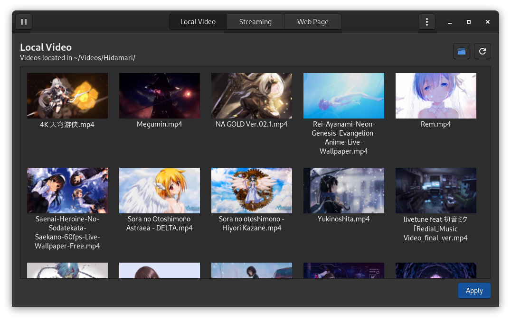
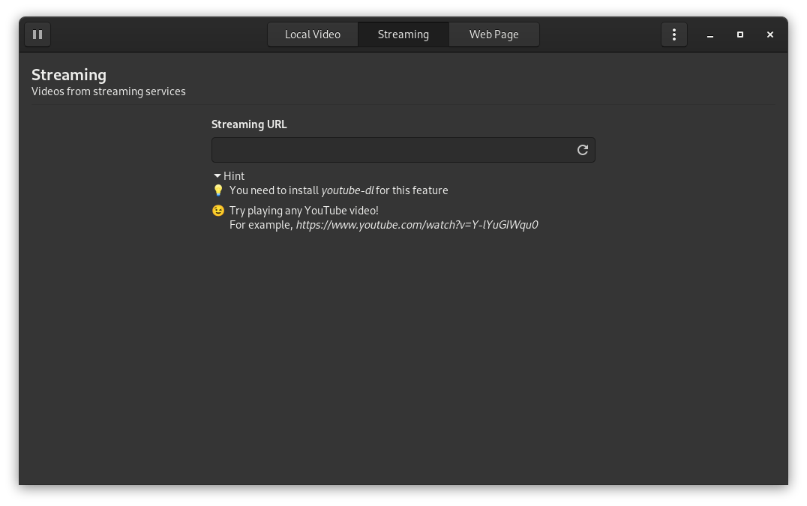

Video wallpaper for Linux. Minimal and written in Python.
  

Hidamari 日溜まり【ひだまり】(n) sunny spot; exposure to the sun

# Hidamari　ーひだまりー

## Features 🔥

There are several solutions to achieve video as wallpaper on Linux, for example:

1. [Xwinwrap + mpv](https://www.linuxuprising.com/2019/05/livestream-wallpaper-for-your-gnome.html)
2. [Komorebi](https://github.com/cheesecakeufo/komorebi)

Hidamari offers similar feature as above, with additional features listed below:

- [x] Autostart after login
- [x] Apply static wallpaper with blur effect 1
- [x] Detect maximized window and fullscreen mode 2
- [x] Volume control
- [x] Mute the playback anytime with just 2 clicks!
- [x] Pause the playback anytime with just 2 clicks!
- [x] I'm feeling lucky 3
- [x] GPU video decoding!
- [x] Gnome Wayland support!
- [x] Multi-monitor support!
- [x] Streaming URL support! 4
- [x] Webpage as wallpaper! 5
- [ ] You name it! =)

1 Video frame can be applied as system wallpaper, look great in <i>GNOME</i>  
2 Automatically pauses playback when maximized window or full screen mode is detected    
3 Randomly select and play a video  
4 Use <i>youtube-dl</i> as backend, tested with YouTube videos  
5 Theoretically it can be anything from a normal webpage to <i>Unity/Godot WebGL games</i>, be creative!

## Installation (Fedora) ⏬

1. Enable Copr `sudo dnf copr enable jeffshee/hidamari`
2. Install `sudo dnf install hidamari`
3. Multimedia codecs, refer
   to [Fedora](https://docs.fedoraproject.org/en-US/quick-docs/assembly_installing-plugins-for-playing-movies-and-music/)

## Installation (Other linux) ⏬

### Prerequisite

1. PyGObject, refer to [Installation](https://pygobject.readthedocs.io/en/latest/getting_started.html)
2. Pillow, pydbus, youtube-dl `pip3 install pillow pydbus python-vlc youtube-dl`
3. Multimedia codecs, refer to [Ubuntu](https://itsfoss.com/install-media-codecs-ubuntu/)
4. FFmpeg

### Installation

0. Prerequisite stated above.
1. Run `bash <(wget -qO- https://raw.githubusercontent.com/jeffshee/hidamari/master/install.sh)`

## Screenshot 📸

## Demo 📽️

Please click on the image to view <i>(redirect to YouTube)</i>

## Please!! (｡>ｕ<｡)

Collaboration is welcome! Let's make it better together~  
Feel free to open an issue if you have any problem or suggestion 🤗  
Star my project if you like it! 🌟  
Stay tune!!

## Contributors ✨

Made with [contributors-img](https://contrib.rocks).  
Icons made by [Freepik](http://www.freepik.com/) from [Flaticon](https://www.flaticon.com)

